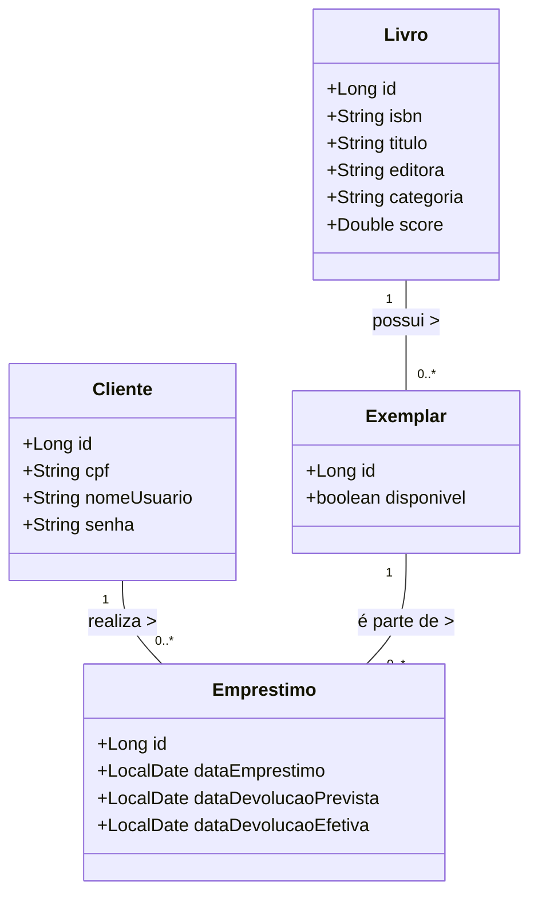

# API Aluguei de livros
Desafio de implementação de backend usando as ferramentas do springboot.

#Diagramas

```mermaid
classDiagram
    class Cliente {
        +Long id
        +String cpf
        +String nomeUsuario
        +String senha
    }

    class Emprestimo {
        +Long id
        +LocalDate dataEmprestimo
        +LocalDate dataDevolucaoPrevista
        +LocalDate dataDevolucaoEfetiva
    }

    class Exemplar {
        +Long id
        +boolean disponivel
    }

    class Livro {
        +Long id
        +String isbn
        +String titulo
        +String editora
        +String categoria
        +Double score
    }

    Cliente "1" -- "0..*" Emprestimo : realiza >
    Exemplar "1" -- "0..*" Emprestimo : é parte de >
    Livro "1" -- "0..*" Exemplar : possui >
```
